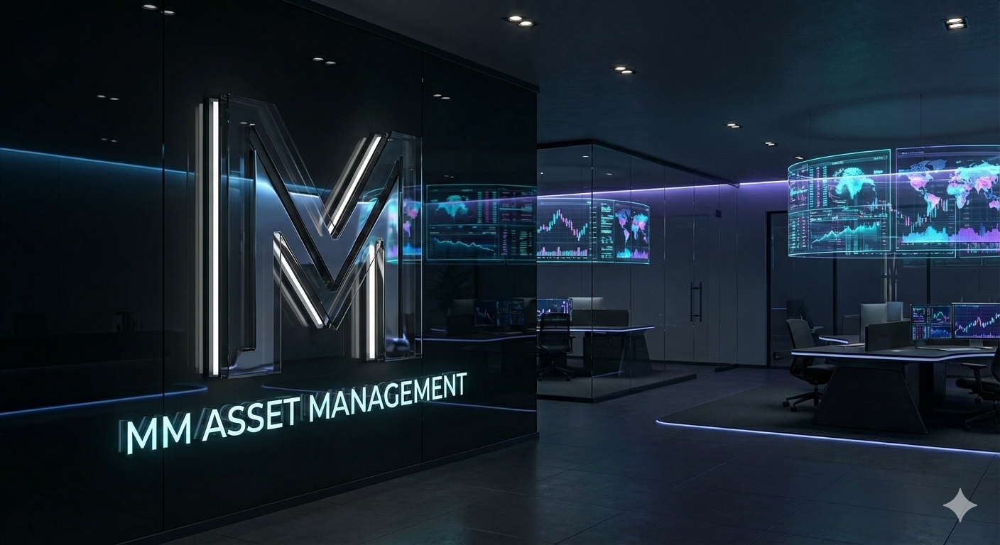
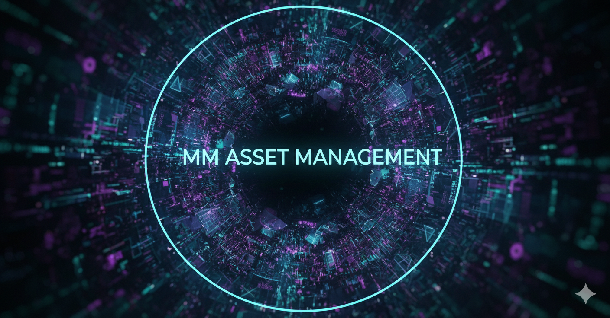

# 🏛️ MMAM — Intelligence Core
### Murillo Medina Asset Management


*A state-of-the-art AI-powered infrastructure for institutional-grade asset management.*

---

## 💎 The Vision
**MMAM** is not just a dashboard; it is a high-frequency intelligence engine. Driven by the **MMAM Strategic Hub**, the platform integrates advanced agentic orchestration with low-latency execution to provide a unified command center for modern capital management.



## 🧠 Intelligence Architecture
Our system leverages the **NVIDIA NIM** ecosystem through a sophisticated Multi-Agent Team:
- **Head of Strategy (Orchestrator)**: Plans and delegates complex financial mandates using high-reasoning models (GLM-5). Now with **Real-Time Portfolio Awareness**.
- **Quantitative Specialist**: Real-time technical analysis and price action modeling.
- **Risk Manager**: Live VaR calculations and fiduciary compliance monitoring.
- **Fiduciary Billing**: Automated mandate economics and fee transparent management.


## 🏗️ Technical Stack
| Layer | Technology |
|---|---|
| **Frontend** | Next.js 15 (App Router) + Tailwind CSS + Lucide + Lightweight Charts |
| **Intelligence** | Pydantic AI + NVIDIA NIM (Mistral Large, GLM-5, Mixtral) |
| **Backend** | FastAPI + Socket.IO + PostgreSQL + Pydantic V2 |
| **Core Engine** | C++ 20 + pybind11 (Low-latency order matching & HFT bindings) |

---

## 🚀 Deployment

### 1. Environmental Sync
Clone the repository and initialize the credentials:
```bash
cp .env.example .env
# Crucial: Ensure NVIDIA_NIM_API_KEY is set for the Intelligence Core.
```

### 2. Backend Engine (Intelligence & API)
```bash
cd backend
python -m venv venv
./venv/Scripts/activate # Windows
pip install -r requirements.txt
python -m app.main
```

### 3. Frontend Terminal (Command Center)
```bash
cd frontend
npm install
npm run dev
```

---

## 📈 Platform Status (Current Implementation)

### 🌑 UI/UX & Aesthetics
- **Cyber-Terminal Sidebar**: Rebranded to **MMAM Intelligence**, featuring a transparent glassmorphism design (`backdrop-blur-2xl`) and neon-blue accents.
- **Theme-Aware Logic**: Fully responsive UI that adapts its neon glow and legibility between **Deep Dark** and **Institutional Light** modes.
- **Real-Time Dashboards**: Interactive charts and treemaps for sector analysis and asset allocation.

### 🤖 AI Sync & Coordination
- **Portfolio-Aware Chat**: The AI assistant now consumes real-time data of holdings, total value, and P&L. Every message sent to the chat carries the latest "snapshot" of the user's wealth.
- **Unified Payload**: All specialist agents (Mistral, GLM-5, etc.) are synchronized with the same portfolio context, ensuring consistent advice across models.

### ⚡ Core Performance
- **Streaming API**: High-speed token streaming for all LLMs to minimize perceived latency.
- **C++ Bindings**: Core matching engine prepared for high-frequency simulation.

---

## 🎨 Visual Identity
The MMAM brand is characterized by its **Obsidian & Cyan Neon** aesthetic, representing the fusion of traditional fiduciary solidity ("Obsidian") and cutting-edge digital intelligence ("Cyan").

*Murillo Medina Asset Management — Empowering the Future of Capital.*
