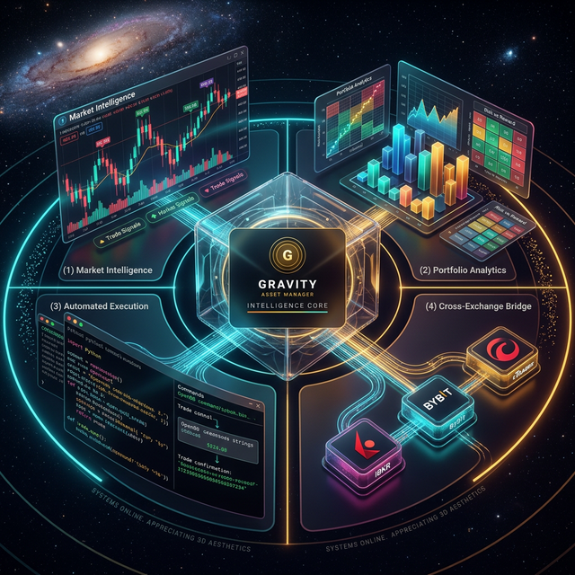
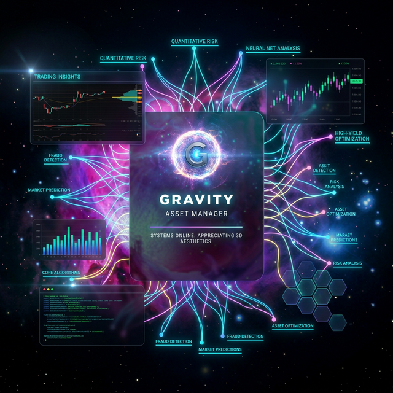

# 🌌 GRAVITY
**Neural Asset Management & Quantum Execution**

 

*Sophisticated computational trading engine. High-density risk analytics. Institutional-grade execution.*

---

## 🏗️ Core Architecture
Gravity is a multi-tier fintech ecosystem designed for precision and scale.

### 1. Intelligence Core (Alpha Agent)
*   **Neural Routing:** LLM-driven agents (`Gemini`, `Claude`) acting as quants and risk managers.
*   **Command Terminal:** Native `OpenBB` integration for institutional data and technical analysis.
*   **Autonomous Analysis:** Real-time sentiment and technical signal generation.

### 2. Market Intelligence
*   **Precision Charting:** High-performance candlestick rendering with Volume Profiles and IV Regimes.
*   **Factor Analysis:** Multi-dimensional risk assessment (VaR, Expected Shortfall, Sharpe).
*   **Real-time Streams:** WebSocket-driven data from IBKR, Bybit, and cTrader.

### 3. Execution Engine
*   **Hybrid Bridge:** Direct order routing to Interactive Brokers and Crypto Exchanges.
*   **Algorithmic Edge:** C++ optimized portfolio backtesting and NAV curve tracing.
*   **Position Management:** Dynamic treemaps and sector exposure monitoring.

---

## 🛠️ User Manual

### Intelligence Terminal
Interact via natural language or direct commands.
- `technical rsi --symbol NVDA --chart true`
- `portfolio.sharpe --assets AMZN,TSLA`
- `market.sentiment --query "semiconductors"`

-----------