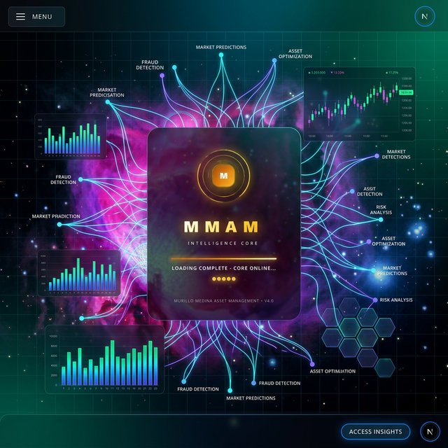

<div align="center">

# ⚡ ALPHA CORE 
**AI-Powered Deep Financial Terminal & Portfolio Manager**



[](#) 
[](#)
[](#)
[](#)
[](#)

*A sophisticated, state-of-the-art computational trading engine and portfolio manager. Built for institutional-grade risk measurement, algorithmic trade execution, and dynamic asset allocation via advanced neural network Agents.*

</div>

<br/>

## 🌐 System Architecture
Alpha Core operates on a rigorous Clean Architecture paradigm, splitting the dense computational backend from the hyper-responsive interactive frontend. 

<div align="center">
  
</div>

### 🔹 Core Capabilities
- **Neural Multi-Agent System:** Dedicated Large Language Models (LLMs) acting as Quants, Risk Managers, Macro Analysts, and Traders operating in continuous consensus. 
- **OpenBB Terminal Native Integration:** Natively parses and routes quantitative commands directly into the `openbb-core` engine for institutional data retrieval.
- **Deep Portfolio Risk Modeling:** Real-time calculation of Expected Shortfall, Value at Risk (VaR), Volatility (σ), and Sharpe Ratios.
- **Micro-second UI Rendering:** Built over a Next.js Bento-Grid interface utilizing Turbopack, providing 60FPS heatmap renditions, NAV curve tracing, and TradingView parallelizations.

## 💻 Tech Stack
| Tier | Technology | Purpose |
| ---- | --------- | ------- |
| **Frontend** | React, Next.js 16, TailwindCSS | Rendering extreme data-density UIs, Responsive Bentos. |
| **Styling** | Vanilla CSS + Tailwind | Clean glassmorphism, institutional dark mode, micro-animations. |
| **Backend** | Python, FastAPI, Pydantic | Asynchronous routing, API endpoints, Model validation. |
| **Data Engine** | OpenBB Platform API | Market Data, Fundamental Analysis, Quantitative Tools. |
| **AI Brain** | Gemini, Claude, Kimi (LLMs) | Multi-Agent autonomous consensus trading routing. |

## 🚀 Quick Start (Node: Alpha-9)

Execute the primary bootstrapping script from the root directory. This will concurrently lift the OpenBB Data Server, the FastAPI Backend, and the Next.js Frontend.

```powershell
.\run_app.ps1
```

**Services Deployed Successfully:**
- 🟢 **Frontend Node:** `http://localhost:3309`
- 🟢 **Core Backend FastAPI:** `http://localhost:8282`
- 🟢 **OpenBB Gateway:** `http://localhost:6900`
- 🟢 **Swagger/OpenAPI:** `http://localhost:6900/docs`

## 📊 Analytics Mechanics
> *Alpha Core does not provide financial advice. It is a research and analytical deployment node.*

1. **NAV Curve Tracing:** Historical P&L vs Exposure matching in real-time.
2. **Allocation Intensity (Treemap):** Dynamic clustering based on notional exposure limits.
3. **Sector Heatmapping:** Capital diversification metrics per GICS standard.
4. **Agentic Terminal:** Interact seamlessly with the LLM agents via the `<ChatPane />` using natural language context for algorithmic commands.

---
<div align="center">
  <p><i>Engineered for Alpha. Built for Precision.</i> 💧</p>
</div>
